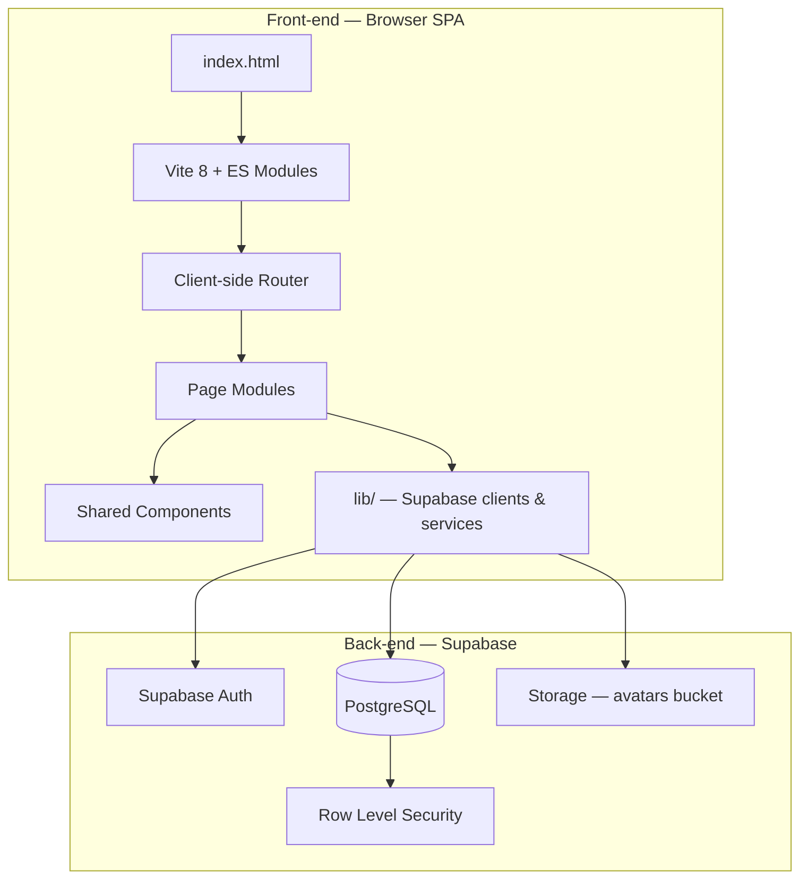

# Nexus Millions

A cyberpunk-themed web trivia game inspired by *Who Wants to Be a Millionaire*. Players register, climb a five-tier prize ladder, answer progressively harder questions, and manage their game history through a single-page application backed by Supabase.

## Project Description

Nexus Millions is a browser-based quiz game where authenticated users compete for virtual prizes across five difficulty levels — from **Warm Up** ($100) to **Mastermind** ($50,000).

### What the app does

- Presents a themed landing page with live animated background effects
- Lets visitors **register** and **log in** via Supabase Auth
- Allows logged-in players to **start games**, answer multiple-choice questions, **cash out**, or get eliminated on a wrong answer
- Stores game sessions and submitted answers in PostgreSQL
- Provides a **game archive** to view, resume, or delete past runs
- Offers a **user profile** page to set a nickname and upload an avatar (max 500 KB)
- Provides an **admin console** for users with the admin role to manage all game data

### Who can do what

| Role | Capabilities |
|------|----------------|
| **Guest** | View home page, register, log in |
| **Authenticated player** | Access dashboard, start/play/view games, manage game archive, edit profile (nickname + avatar), log out |
| **Admin** | All player capabilities plus full CRUD on games, users, questions, answers, and levels via `/admin` |
| **Database (RLS)** | Enforces per-user data access; admins bypass restrictions via `is_admin()` policies |

### Main routes

| URL | Page | Access |
|-----|------|--------|
| `/` | Home | Public |
| `/login` | Login / Register | Guests only (redirects if logged in) |
| `/dashboard` | Mission Control | Authenticated |
| `/games` | Game archive | Authenticated |
| `/game/start` | Create new game → redirect to play | Authenticated |
| `/game/{id}/play` | Play or view a game | Authenticated |
| `/profile` | User profile | Authenticated |
| `/admin` | Admin console (tabbed CRUD) | Admin only |

---

## Architecture



### Front-end

- **Vite 8** — dev server, bundler, and production build
- **Vanilla JavaScript (ES modules)** — no React/Vue; modular page and component files
- **Bootstrap 5** — layout, forms, modals, responsive UI
- **Bootstrap Icons** — icon set
- **Custom CSS** — cyberpunk design system (glass panels, neon glow, animated canvas background)
- **Client-side routing** — History API with lazy-loaded page modules

Each page and layout component is split into separate **HTML**, **CSS**, and **JS** files. HTML templates are imported via Vite's `?raw` suffix.

### Back-end

There is no custom Node.js/API server. The back-end is fully managed by **Supabase**:

| Service | Purpose |
|---------|---------|
| **Supabase Auth** | Email/password registration and login |
| **PostgreSQL** | Game data, quiz content, user profiles |
| **Supabase Storage** | Avatar image uploads (`avatars` bucket, 500 KB limit) |
| **Row Level Security (RLS)** | Per-user data access policies on all tables |

The browser talks to Supabase directly using the **anon key** (`@supabase/supabase-js`). A **service role key** is only used by the local seed script (`npm run seed`), never in the front-end.

### Technologies

| Layer | Stack |
|-------|-------|
| Runtime | Node.js, npm |
| Front-end build | Vite 8 |
| UI | HTML, CSS, JavaScript, Bootstrap 5 |
| Fonts | Orbitron, Rajdhani, Share Tech Mono (Google Fonts) |
| Back-end / DB | Supabase (PostgreSQL 15+) |
| Auth | Supabase Auth |
| Storage | Supabase Storage |
| Migrations | Supabase CLI + SQL migrations |

---

## Database Schema Design

### Entity relationship diagram

```mermaid
erDiagram
    auth_users ||--o| profiles : has
    auth_users ||--o{ games : owns
    game_levels ||--o{ questions : contains
    game_levels ||--o{ games : achieved_level
    game_levels ||--o{ user_answers : level_at_answer
    questions ||--o{ answers : has
    answers ||--o| questions : true_answer
    questions ||--o{ games : current_question
    games ||--o{ user_answers : records
    questions ||--o{ user_answers : answered
    answers ||--o{ user_answers : selected

    auth_users {
        uuid id PK
    }

    profiles {
        uuid id PK_FK
        text email
        text nickname
        text avatar_url
        boolean is_admin
        timestamptz updated_at
    }

    game_levels {
        serial id PK
        text name
        numeric prize
        integer rank
    }

    questions {
        uuid id PK
        text value
        integer level_id FK
        integer points
        uuid true_answer_id FK
    }

    answers {
        uuid id PK
        uuid question_id FK
        text value
    }

    games {
        uuid id PK
        uuid owner FK
        integer total_points
        integer achieved_level FK
        timestamptz started_at
        timestamptz finished_at
        uuid current_question_id FK
    }

    user_answers {
        uuid id PK
        uuid game_id FK
        uuid question_id FK
        uuid answer_id FK
        integer level_id FK
        integer points
        boolean is_true
        timestamptz answered_at
    }
```

### Tables summary

| Table | Description |
|-------|-------------|
| `auth.users` | Managed by Supabase Auth — no custom users table |
| `profiles` | Nickname, email, avatar URL, and `is_admin` flag per user |
| `game_levels` | Five progression tiers (rank, name, prize) |
| `questions` | Quiz questions linked to a level |
| `answers` | Four multiple-choice options per question |
| `games` | A player's game session (owner, level, timestamps) |
| `user_answers` | Each answer submitted during a game |

### Storage

| Bucket | Purpose | Limit |
|--------|---------|-------|
| `avatars` | User profile images | 500 KB, JPEG/PNG/GIF/WebP |

### Migrations

All schema changes live in `supabase/migrations/`:

| Migration | Description |
|-----------|-------------|
| `20260702120000_initial_game_schema.sql` | Core tables, RLS baseline |
| `20260703100000_games_delete_policy.sql` | DELETE policy on `games` |
| `20260703120000_user_profiles.sql` | Profiles table, avatar storage, signup trigger |
| `20260703140000_admin_role.sql` | Admin role, email on profiles, admin RLS, `admin_delete_user` RPC |

### Admin bootstrap

After migrations are applied, promote your first admin manually in the Supabase SQL Editor:

```sql
update public.profiles set is_admin = true where email = 'your@email.com';
```

Only users with `is_admin = true` can access `/admin`. Additional admins can be granted via the **Users** tab in the admin console.

See also [`docs/required-db-schema.md`](docs/required-db-schema.md) for the original schema specification.

---

## Local Development Setup

### Prerequisites

- [Node.js](https://nodejs.org/) 18+ and npm
- A [Supabase](https://supabase.com/) project (free tier works)
- [Supabase CLI](https://supabase.com/docs/guides/cli) (optional, for local migration workflow)

### 1. Clone and install

```bash
git clone <your-repo-url>
cd nexus-game
npm install
```

### 2. Configure environment variables

Copy the example env file and fill in your Supabase credentials:

```bash
cp .env.example .env
```

| Variable | Used by | Description |
|----------|---------|-------------|
| `VITE_SUPABASE_URL` | Front-end | Supabase project URL |
| `VITE_SUPABASE_ANON_KEY` | Front-end | Public anon API key |
| `SUPABASE_URL` | Seed script | Same project URL |
| `SUPABASE_SERVICE_ROLE_KEY` | Seed script | Service role key (server-side only) |

Find these in **Supabase Dashboard → Project Settings → API**.

> **Never** expose the service role key in client-side code or commit it to version control.

### 3. Apply database migrations

If using the Supabase CLI linked to your remote project:

```bash
npx supabase link
npx supabase db push
```

Or apply the SQL files manually via the Supabase SQL Editor (in order, by filename).

### 4. Seed sample quiz data

Populates 5 game levels, 105 questions (21 per level), and 420 answers:

```bash
npm run seed
```

Use `--force` to clear and re-seed:

```bash
npm run seed -- --force
```

### 5. Run the dev server

```bash
npm run dev
```

Open the URL shown in the terminal (typically `http://localhost:5173`).

### 6. Build for production

```bash
npm run build
npm run preview
```

---

## Key Folders and Files

```
nexus-game/
├── index.html                  # App shell — fonts, #app mount point
├── vite.config.js              # Vite SPA configuration
├── package.json                # Dependencies and npm scripts
├── .env.example                # Environment variable template
│
├── src/
│   ├── main.js                 # Entry point — Bootstrap, styles, init app
│   ├── app.js                  # Layout orchestration, auth guards, routing
│   ├── router.js             # URL patterns and client-side navigation
│   │
│   ├── styles/
│   │   └── main.css            # Global cyberpunk design system
│   │
│   ├── lib/
│   │   ├── supabase.js         # Supabase browser client
│   │   ├── auth.js             # Login, register, logout, session helpers
│   │   ├── games.js            # Game CRUD, answer submission, cash out
│   │   ├── profile.js          # Profile read/update, avatar upload
│   │   ├── admin.js            # Admin CRUD for all game assets
│   │   └── format.js           # Currency, date, duration formatters
│   │
│   ├── components/
│   │   ├── header/             # Sticky navbar (HTML, CSS, JS)
│   │   ├── footer/             # Site footer
│   │   └── background-fx/      # Animated canvas background
│   │
│   └── pages/
│       ├── home/               # Landing page with CTA
│       ├── login/              # Login & register forms
│       ├── dashboard/          # Player stats overview
│       ├── games/              # Game archive table + delete modal
│       ├── game-start/         # Creates a new game, redirects to play
│       ├── game/               # Active game / view finished game
│       ├── profile/            # Nickname and avatar management
│       └── admin/              # Admin console with tabbed CRUD
│           └── tabs/           # Games, Users, Questions, Answers, Levels
│
├── scripts/
│   ├── seed.js                 # Database seed runner
│   └── seed-data.js            # Quiz content (levels, questions, answers)
│
├── supabase/
│   ├── config.toml             # Supabase CLI project config
│   └── migrations/             # SQL migration files (versioned schema)
│
└── docs/
    └── required-db-schema.md   # Original DB schema specification
```

### File conventions

- **Pages** — each folder contains `*.html` (template), `*.css` (page styles), `*.js` (exports `render()`, `init()`, and `meta`)
- **Components** — same HTML/CSS/JS split; injected into the layout shell by `app.js`
- **lib/** — shared logic with no UI; imported by page modules
- **Migrations** — timestamped SQL files applied in order; never edit applied migrations

---

## npm Scripts

| Command | Description |
|---------|-------------|
| `npm run dev` | Start Vite dev server with HMR |
| `npm run build` | Production build to `dist/` |
| `npm run preview` | Preview the production build locally |
| `npm run seed` | Seed quiz data into Supabase |

---

## License

Private project — all rights reserved.
