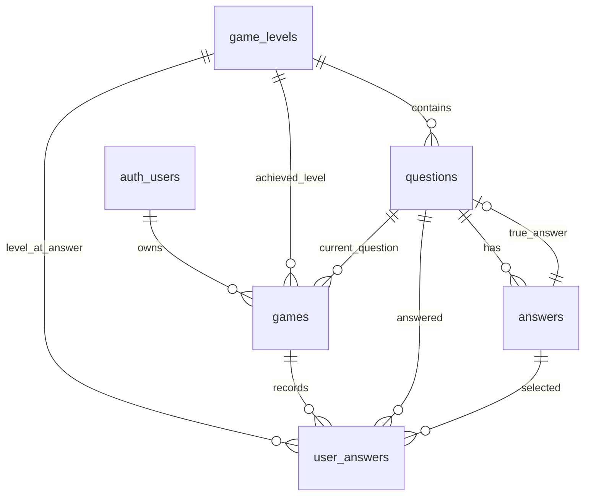

# Required DB Schema

Simplified initial database schema for Nexus Game, managed with Supabase migrations.

**Migration file:** `supabase/migrations/20260702120000_initial_game_schema.sql`

## Overview

| Entity        | Table           | Notes                                      |
|---------------|-----------------|--------------------------------------------|
| Users         | `auth.users`    | Managed by Supabase Auth (no custom table) |
| Game Levels   | `game_levels`   | Progression tiers with prize and rank      |
| Questions     | `questions`     | Quiz questions per level                   |
| Answers       | `answers`       | Options for each question                  |
| Games         | `games`         | Player game sessions                       |
| User Answers  | `user_answers`  | Answers submitted during a game            |

## Entity Relationship

## Tables

### Users (`auth.users`)

Users are handled by **Supabase Auth**. Game ownership references `auth.users(id)` directly — no separate public users table.

---

### Game Levels (`game_levels`)

Progression tiers with prize and ordering rank.

| Column | Type            | Constraints                          |
|--------|-----------------|--------------------------------------|
| `id`   | `serial`        | Primary key                          |
| `name` | `text`          | Not null                             |
| `prize`| `numeric(10,2)` | Not null, default `0`                |
| `rank` | `integer`       | Not null, unique, check `rank > 0`   |

---

### Questions (`questions`)

Quiz questions belonging to a game level.

| Column           | Type      | Constraints                                      |
|------------------|-----------|--------------------------------------------------|
| `id`             | `uuid`    | Primary key, default `gen_random_uuid()`         |
| `value`          | `text`    | Not null — question text                         |
| `level_id`       | `integer` | Not null, FK → `game_levels(id)`                 |
| `points`         | `integer` | Not null, default `0`, check `points >= 0`       |
| `true_answer_id` | `uuid`    | Nullable, FK → `answers(id)` — correct answer    |

---

### Answers (`answers`)

Answer options for each question.

| Column        | Type   | Constraints                              |
|---------------|--------|------------------------------------------|
| `id`          | `uuid` | Primary key, default `gen_random_uuid()` |
| `question_id` | `uuid` | Not null, FK → `questions(id)` CASCADE   |
| `value`       | `text` | Not null — answer text                   |

---

### Games (`games`)

A game session owned by an authenticated user.

| Column                | Type          | Constraints                                      |
|-----------------------|---------------|--------------------------------------------------|
| `id`                  | `uuid`        | Primary key, default `gen_random_uuid()`         |
| `owner`               | `uuid`        | Not null, FK → `auth.users(id)` CASCADE          |
| `total_points`        | `integer`     | Not null, default `0`, check `total_points >= 0` |
| `achieved_level`      | `integer`     | Not null, default `1`, FK → `game_levels(id)`    |
| `started_at`          | `timestamptz` | Not null, default `now()`                        |
| `finished_at`         | `timestamptz` | Nullable                                         |
| `current_question_id` | `uuid`        | Nullable, FK → `questions(id)` SET NULL          |

**Check:** `finished_at` is null or `finished_at >= started_at`

---

### User Answers (`user_answers`)

Records each answer a player submits during a game.

| Column        | Type          | Constraints                                      |
|---------------|---------------|--------------------------------------------------|
| `id`          | `uuid`        | Primary key, default `gen_random_uuid()`         |
| `game_id`     | `uuid`        | Not null, FK → `games(id)` CASCADE               |
| `question_id` | `uuid`        | Not null, FK → `questions(id)`                   |
| `answer_id`   | `uuid`        | Not null, FK → `answers(id)`                     |
| `level_id`    | `integer`     | Not null, FK → `game_levels(id)`                 |
| `points`      | `integer`     | Not null, default `0`, check `points >= 0`       |
| `is_true`     | `boolean`     | Not null, default `false`                        |
| `answered_at` | `timestamptz` | Not null, default `now()`                        |

**Unique:** `(game_id, question_id)` — one answer per question per game.

## Row Level Security

RLS is enabled on all public tables with a simplified baseline:

| Table          | Policy                                              |
|----------------|-------------------------------------------------------|
| `game_levels`  | Readable by everyone                                  |
| `questions`    | Readable by everyone                                  |
| `answers`      | Readable by everyone                                  |
| `games`        | Users can view, create, and update their own games    |
| `user_answers` | Users can view and submit answers for their own games |

## Design Notes

- **Users** — `games.owner` references `auth.users(id)`; no duplicate user table.
- **true_answer** — stored as `true_answer_id` (FK to `answers.id`) so correctness is tied to a specific answer row.
- **level** (in user answers) — stored as `level_id` (FK to `game_levels`) to record which level the player was on when answering.
